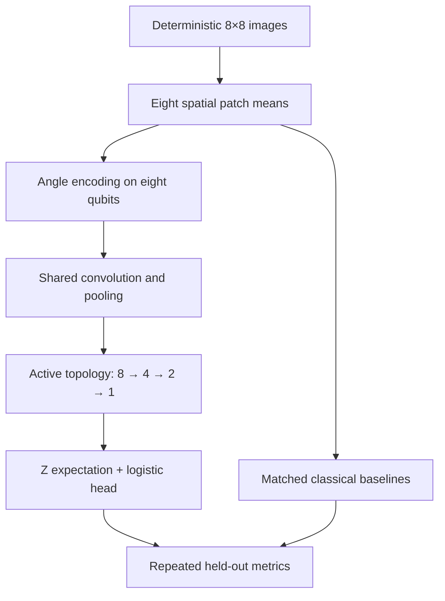
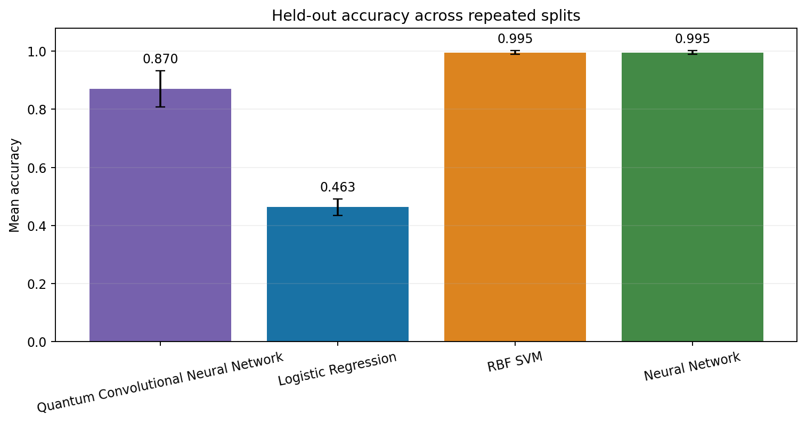

# Quantum Convolutional Neural Network

**Created by School of AI and School of QC**

[](https://github.com/vivianaranha/quantum-convolutional-neural-network/actions/workflows/ci.yml)
[](https://www.python.org/)
[](LICENSE)

A reproducible, local-first image-classification project that trains an eight-qubit quantum convolutional neural network (QCNN) and compares it with logistic regression, an RBF support-vector machine, and a small neural network. Every model receives the same eight spatial features and the same train/test rows.

This repository is designed as an honest learning and benchmarking project. It uses exact statevector simulation on a classical computer, includes controlled finite-shot and parameter-noise probes, and makes **no claim of quantum advantage or hardware performance**.

## Why this project exists

Most QCNN examples stop at a circuit sketch. This project connects the full workflow:

- deterministic image generation with known nuisance factors;
- spatial compression from an 8×8 image to eight patch features;
- a three-stage, shared-parameter QCNN with an 8 → 4 → 2 → 1 topology;
- matched-input classical baselines;
- repeated, stratified held-out evaluation;
- model persistence and single-image inference;
- plots, diagnostics, provenance, tests, CI, and an interactive app.

It is useful for students learning quantum machine learning, instructors demonstrating fair evaluation, and engineers who want a small but complete reference implementation.

## Architecture



Each quantum stage shares four parameters across its active qubit pairs: three convolution parameters and one pooling parameter. Across three stages, the circuit has 12 shared quantum parameters. A learned scale and bias form the two-parameter classical head, for 14 trainable parameters total.

See [the architecture guide](docs/ARCHITECTURE.md) and [the QCNN derivation](docs/QCNN.md) for the exact gates, feature map, gradients, and parity tests.

## What is included

- A vectorized NumPy statevector simulator for the fixed eight-qubit circuit.
- A Qiskit circuit representation used for diagnostics and numerical parity tests.
- Exact occurrence-wise parameter-shift gradients for shared circuit parameters.
- Logistic regression, calibrated RBF SVM, and one-hidden-layer MLP baselines.
- Accuracy, balanced accuracy, precision, recall, F1, ROC AUC, log loss, timing, and model-complexity records.
- Occlusion subgroup analysis plus 256-shot and parameter-noise sensitivity probes.
- Reusable JSON/joblib model artifacts and safe input validation.
- CLI, Streamlit dashboard, notebook, 65 tests, linting, packaging, and GitHub Actions CI.

## Quick start

Python 3.11 or 3.12 is recommended.

```bash
git clone https://github.com/vivianaranha/quantum-convolutional-neural-network.git
cd quantum-convolutional-neural-network
python -m venv .venv
source .venv/bin/activate  # Windows: .venv\Scripts\activate
python -m pip install --upgrade pip
python -m pip install -e ".[dev]"
```

Run the complete reference benchmark:

```bash
quantum-cnn benchmark --config configs/default.json
```

The reference configuration trains three deterministic 70/30 repeated holdouts over 240 generated images. It takes roughly two minutes on a typical laptop because QCNN training performs exact statevector simulations and parameter-shift evaluations.

For a fast smoke run:

```bash
quantum-cnn benchmark --samples 80 --repeats 1 --qcnn-epochs 5 --seed 7
```

## Interactive dashboard

```bash
streamlit run app.py
```

Use the sidebar to change the sample count, image noise, occlusion rate, split count, epochs, and seed. The app shows comparison charts, the generated images, QCNN learning curves, sensitivity probes, circuit text, and live inference with the saved first-repeat models.

## Saved-model inference

After a benchmark completes, copy its printed artifact path into this command:

```bash
quantum-cnn predict \
  --artifacts artifacts/run-YYYYMMDDTHHMMSSZ \
  --orientation horizontal \
  --position 3 \
  --thickness 1 \
  --noise 0.12 \
  --seed 7
```

You can instead pass an 8×8 `.npy` or comma-separated `.csv` image with `--image`. Pixel values must be finite and within `[0, 1]`.

Important: the QCNN is stored as auditable JSON. The classical models use joblib/pickle; load them only from benchmark directories you trust.

## Reference result

The frozen seed-42 reference run uses the committed configuration without post-hoc tuning. Its exact metrics and environment are recorded in [Reference results](docs/RESULTS.md), while machine-readable summaries live in [`examples/reference-run`](examples/reference-run).

- **QCNN:** accuracy `0.8704 ± 0.0625`, F1 `0.8586`, ROC AUC `0.9334`.
- **Logistic regression:** accuracy `0.4630 ± 0.0285`, F1 `0.4524`, ROC AUC `0.4730`.
- **Calibrated RBF SVM:** accuracy `0.9954 ± 0.0065`, F1 `0.9953`, ROC AUC `1.0000`.
- **Neural network:** accuracy `0.9954 ± 0.0065`, F1 `0.9953`, ROC AUC `1.0000`.



The comparison is intentionally descriptive. Three repeated holdouts on a synthetic task are not enough to establish broad superiority, and simulator timing is not quantum-hardware runtime.

## Reproducibility contract

The dataset, split assignments, initialization, sensitivity-probe sampling, and model random states all derive from the configured seed. A run records:

- the resolved configuration and dependency versions;
- every generated image and compressed feature;
- every split assignment and held-out prediction;
- per-split and aggregate metrics;
- QCNN learning curves, circuit diagnostics, and sensitivity results;
- the first-repeat fitted models and inference manifest;
- presentation-ready plots and a Markdown report.

Wall-clock timing can vary by machine. Exact floating-point values can vary slightly across dependency versions or BLAS implementations. The committed reference artifacts identify the environment that produced them.

## Testing and quality

```bash
make verify
```

This runs formatting checks, static linting, 65 unit/integration tests, and Python package builds. The tests cover data validation, deterministic generation, state normalization, NumPy/Qiskit circuit parity, analytical-gradient parity, training behavior, metric aggregation, split isolation, artifact completeness, serialization, CLI inference, the notebook, and Streamlit rendering.

Useful individual commands:

```bash
make format
make lint
make test
make build
```

## Repository guide

- `src/quantum_cnn/` — dataset, simulator, models, benchmark, persistence, plots, inference, and CLI.
- `configs/default.json` — frozen reference experiment.
- `tests/` — unit, numerical, and end-to-end tests.
- `notebooks/quickstart.ipynb` — short programmatic walkthrough.
- `examples/reference-run/` — selected outputs from the frozen seed-42 run.
- `docs/assets/` — inspected reference figures used by the documentation.
- `docs/` — architecture, methodology, results, model card, experiment guide, and responsible-use notes.
- `app.py` — Streamlit dashboard.
- `.github/workflows/ci.yml` — Python 3.11/3.12 continuous integration.

See [PROJECT-MANIFEST.md](PROJECT-MANIFEST.md) for the complete file map.

## Scientific boundaries

- The input is a deliberately small synthetic benchmark, not a real-world vision dataset.
- The eight patch means discard substantial pixel-level information.
- The simulator is noiseless unless a named sensitivity probe is applied.
- Parameter noise and finite shots are simplified interventions, not a physical noise model.
- No quantum hardware is contacted and no cloud credentials are required.
- Model comparisons are matched on input and split rows, but not on equal compute budgets.
- This project does not demonstrate quantum advantage.

Read [the model card](docs/MODEL-CARD.md) and [responsible-use guide](docs/RESPONSIBLE-USE.md) before adapting the code to consequential data.

## Foundations

The QCNN idea was introduced by Cong, Choi, and Lukin in [Quantum convolutional neural networks](https://doi.org/10.1038/s41567-019-0648-8), *Nature Physics* 15, 1273–1278 (2019). This repository adapts the hierarchical convolution/pooling intuition to a small classical-image experiment; it is not a reproduction of that paper.

Implementation and validation references:

- [IBM Quantum: Qiskit Statevector API](https://quantum.cloud.ibm.com/docs/en/api/qiskit/qiskit.quantum_info.Statevector)
- [IBM Quantum: exact simulation with Qiskit SDK primitives](https://quantum.cloud.ibm.com/docs/en/guides/simulate-with-qiskit-sdk-primitives)
- [scikit-learn: calibrated classifiers](https://scikit-learn.org/stable/modules/generated/sklearn.calibration.CalibratedClassifierCV.html)
- [scikit-learn: support-vector classification](https://scikit-learn.org/stable/modules/generated/sklearn.svm.SVC.html)

## Contributing and security

Contributions are welcome. Start with [CONTRIBUTING.md](CONTRIBUTING.md), follow the [Code of Conduct](CODE_OF_CONDUCT.md), and report vulnerabilities using [SECURITY.md](SECURITY.md). Planned extensions are listed in [ROADMAP.md](ROADMAP.md).

## License

Released under the [MIT License](LICENSE).

**Created by School of AI and School of QC**
