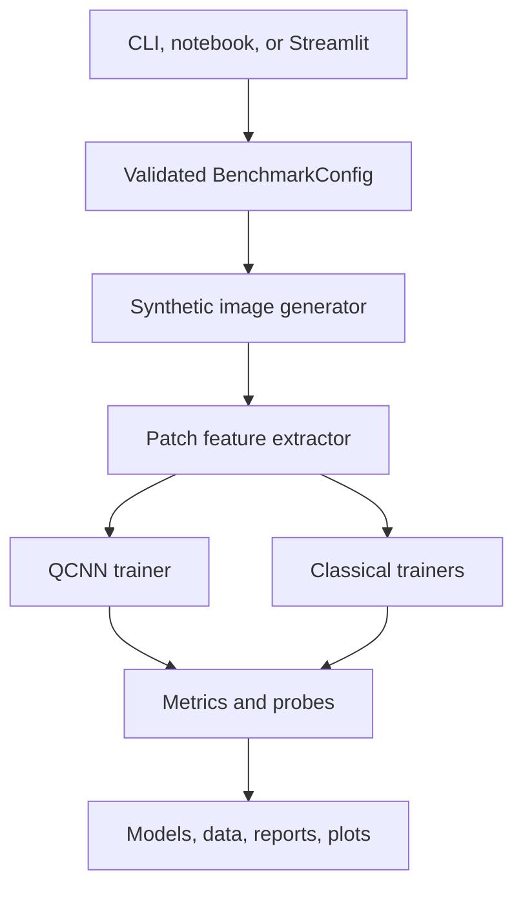
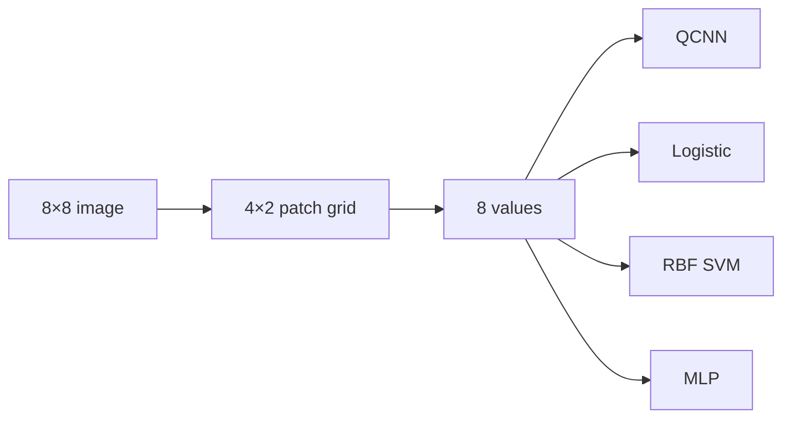
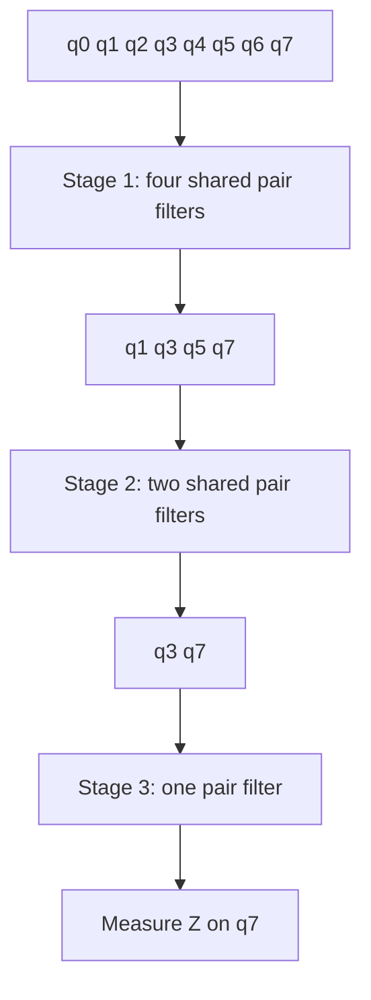

# Architecture

**Created by School of AI and School of QC**

## System boundary

The project is a local Python application. It generates data, trains all models, evaluates held-out rows, saves artifacts, and serves an optional Streamlit interface. It does not send data to an external service and does not require an API key.

## Runtime modules

- `config.py` owns immutable settings, validation, JSON loading, and CLI overrides.
- `data.py` creates balanced 8×8 images and maps them to eight patch means.
- `qcnn.py` contains the vectorized simulator, circuit topology, optimizer, parameter-shift training, and Qiskit diagnostic circuit.
- `models.py` wraps the QCNN for persistence and constructs the three matched-input baselines.
- `metrics.py` computes classification metrics and repeated-holdout summaries.
- `benchmark.py` owns split generation, fit/evaluate orchestration, robustness probes, and subgroup analysis.
- `artifacts.py` writes provenance, data, metrics, models, circuit text, reports, and plots.
- `inference.py` validates one image and scores it with saved models.
- `visualization.py` creates static PNG summaries with a non-interactive backend.
- `cli.py` exposes `benchmark` and `predict` commands.

## Data flow

The split is generated over immutable row identifiers. Feature extraction happens deterministically, and every model indexes the same `x_train`, `x_test`, `y_train`, and `y_test` arrays for each repeat. The saved `split_assignments.csv` makes this check auditable.

## QCNN topology

Stage one acts on `(0,1)`, `(2,3)`, `(4,5)`, and `(6,7)` and retains qubits 1, 3, 5, and 7. Stage two acts on `(1,3)` and `(5,7)` and retains qubits 3 and 7. Stage three acts on `(3,7)` and retains qubit 7.

The circuit keeps all eight qubits in the simulated state; “active” means that later convolution stages act only on retained sink qubits. This mirrors pooling semantics without mid-circuit reset or measurement.

## Persistence boundary

Each benchmark creates a timestamped directory under `artifacts/`. JSON, CSV, NPZ, PNG, and Markdown files are transparent data artifacts. The QCNN model is JSON. Scikit-learn models are stored with joblib and therefore must be loaded only from trusted directories.

## Dependency choices

- NumPy provides deterministic vectorized state evolution.
- Qiskit provides an independent circuit representation for parity tests and diagnostics.
- pandas and scikit-learn provide evaluation and classical baselines.
- matplotlib generates static reports.
- Streamlit provides an optional interactive front end.

## Design tradeoffs

- A fixed eight-qubit simulator keeps the implementation inspectable and fast enough for CI, but it is not a general-purpose quantum simulator.
- Patch means preserve coarse spatial organization and fit eight qubits, but discard texture and fine geometry.
- Full-batch exact gradients are stable and reproducible, but computationally expensive.
- Shared parameters express the convolutional inductive bias, but the topology is not translation invariant in the classical CNN sense.
- Repeated holdouts expose split variation, but do not replace validation on independent datasets.

**Created by School of AI and School of QC**
