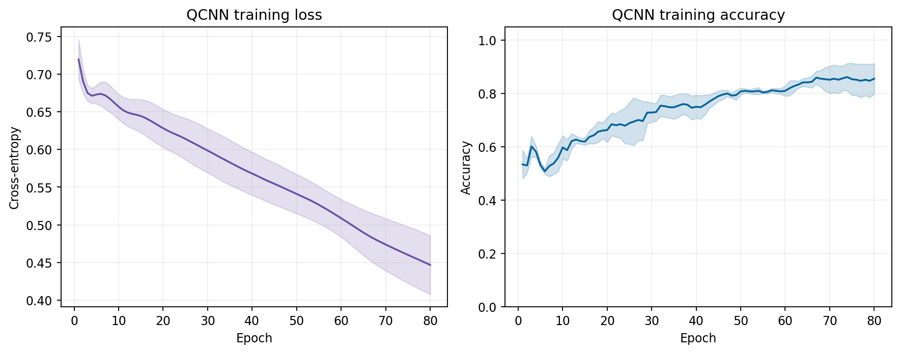
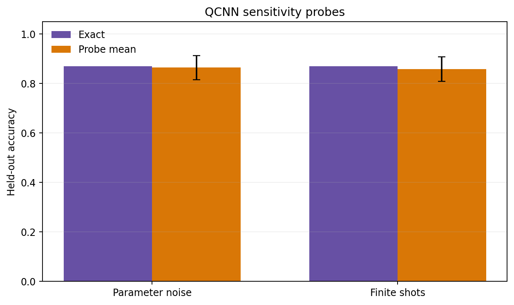
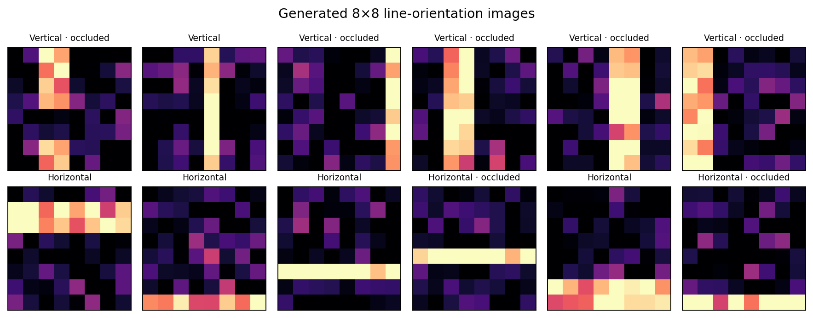

# Reference results

**Created by School of AI and School of QC**

This page records the single frozen seed-42 reference benchmark defined by `configs/default.json`. The settings were fixed before this run; no reference-test result was used for further tuning.

## Protocol snapshot

- 240 balanced synthetic 8×8 images.
- Image-noise level 0.16 and occlusion probability 0.25.
- Three stratified 70/30 holdouts with split seeds 10042, 10043, and 10044.
- Eight identical patch-mean inputs for every model.
- 80 QCNN epochs, learning rate 0.05, and L2 penalty 0.0005.
- Exact 256-amplitude statevector execution; no quantum hardware.

## Aggregate held-out metrics

Values after `±` are population standard deviations over the three repeats.

- **Quantum Convolutional Neural Network:** accuracy `0.8704 ± 0.0625`; balanced accuracy `0.8704 ± 0.0625`; precision `0.9227`; recall `0.8056`; F1 `0.8586`; ROC AUC `0.9334`; log loss `0.4327`; mean fit time `38.7397 s`.
- **Logistic Regression:** accuracy `0.4630 ± 0.0285`; balanced accuracy `0.4630 ± 0.0285`; precision `0.4612`; recall `0.4444`; F1 `0.4524`; ROC AUC `0.4730`; log loss `0.7207`; mean fit time `0.0032 s`.
- **RBF SVM:** accuracy `0.9954 ± 0.0065`; balanced accuracy `0.9954 ± 0.0065`; precision `1.0000`; recall `0.9907`; F1 `0.9953`; ROC AUC `1.0000`; log loss `0.0181`; mean fit time `0.0068 s`.
- **Neural Network:** accuracy `0.9954 ± 0.0065`; balanced accuracy `0.9954 ± 0.0065`; precision `1.0000`; recall `0.9907`; F1 `0.9953`; ROC AUC `1.0000`; log loss `0.0093`; mean fit time `0.0052 s`.

The QCNN used 14 trainable parameters. Logistic regression used nine. The neural network used 81. The RBF SVM used 27–28 support vectors depending on the split; that count is not directly equivalent to a trainable-parameter count.


## Split-level behavior

- **Split 10042:** QCNN `0.9583`; logistic regression `0.4583`; RBF SVM `1.0000`; neural network `1.0000`.
- **Split 10043:** QCNN `0.8333`; logistic regression `0.4306`; RBF SVM `1.0000`; neural network `0.9861`.
- **Split 10044:** QCNN `0.8194`; logistic regression `0.5000`; RBF SVM `0.9861`; neural network `1.0000`.

The RBF SVM and neural network each recorded two split wins or ties. QCNN accuracy varied more across splits, which is visible in the aggregate error bar and argues against reading the mean alone.

## QCNN optimization

Training loss decreased on every repeat:

- repeat 0: `0.7290` → `0.3925`;
- repeat 1: `0.6833` → `0.4676`;
- repeat 2: `0.7462` → `0.4800`.

Final training accuracy was `0.9345`, `0.8095`, and `0.8214` respectively. The three repeat traces were aggregated by epoch for the figure below.



## Sensitivity probes

The mean clean QCNN accuracy was `0.8704`.

- Gaussian circuit-parameter noise with standard deviation `0.04` produced mean accuracy `0.8639`, an average change of `-0.0065` over ten trials per repeat.
- A 256-shot measurement estimate produced mean accuracy `0.8583`, an average change of `-0.0120` over ten trials per repeat.

These interventions start from each fitted QCNN and do not retrain it. They are not measurements from a physical device and do not model a named backend.



## Occlusion diagnostic

Pooling repeated held-out predictions across the three splits, the QCNN achieved `0.8841` accuracy on 164 non-occluded appearances and `0.8269` on 52 occluded appearances. The RBF SVM achieved `1.0000` and `0.9808`; the neural network achieved `0.9939` and `1.0000`; logistic regression achieved `0.4573` and `0.4808`.

The same generated row can appear in the test set of more than one repeat, so those counts are held-out appearances, not unique observations. The occluded sample count is small and the comparison is diagnostic only.

## Circuit and environment

The symbolic circuit used eight logical qubits, 21 controlled-X gates, 29 `RY` gates, 15 `RZ` gates, circuit depth 20 after decomposition, and 28 parameterized gate occurrences. Each epoch used 57 exact statevector passes; one 80-epoch fit used 4,560.

The reference environment used Python 3.12.14, NumPy 2.3.5, pandas 2.2.3, SciPy 1.17.0, scikit-learn 1.8.0, Qiskit 2.5.2, and Streamlit 1.64.0.



## How to reproduce

```bash
python -m pip install -e ".[dev]"
quantum-cnn benchmark --config configs/default.json
```

Exact fit times depend on the machine. Small floating-point differences may occur with other dependency or BLAS versions. The reference configuration, dependency snapshot, aggregate results, per-split results, diagnostics, sensitivity probes, subgroup records, and selected figures are preserved in [`examples/reference-run`](../examples/reference-run).

## Interpretation

These are descriptive results for a small synthetic task. Three repeated holdouts do not establish statistical superiority. QCNN timings are CPU simulator timings, and sensitivity probes are not quantum-device results. The experiment does not demonstrate quantum advantage.

**Created by School of AI and School of QC**
